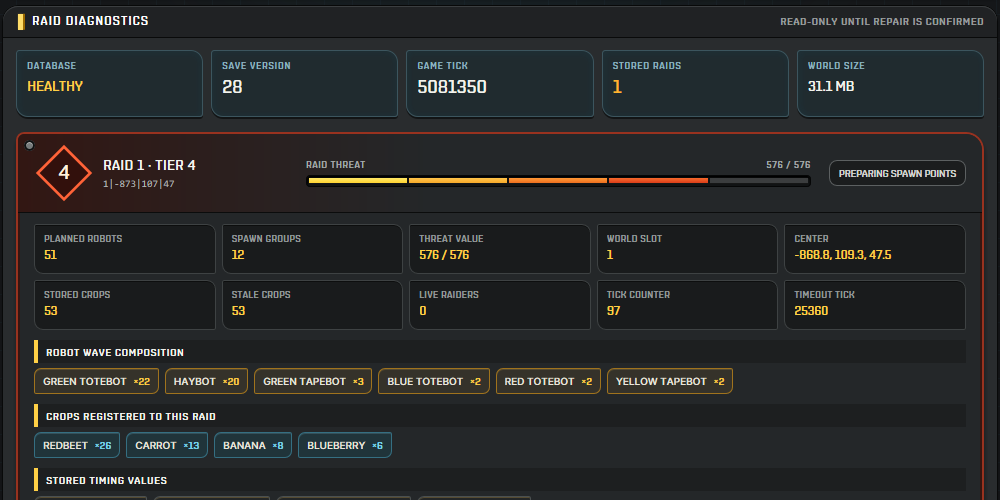
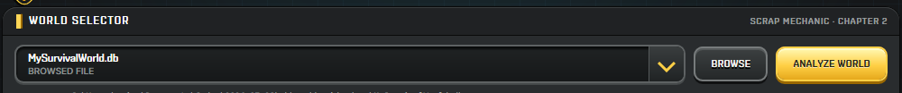
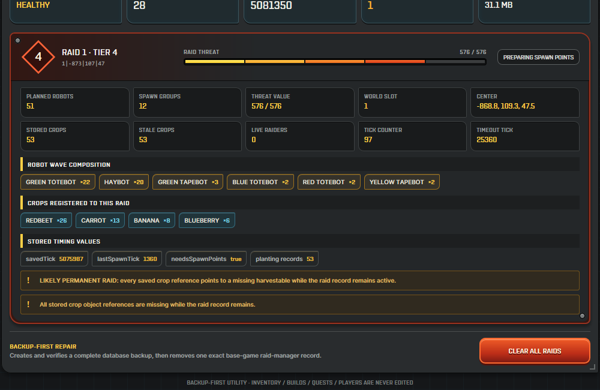

# Raid Rescue

> A small, backup-first world diagnostic and recovery tool for Scrap Mechanic
> Chapter 2 Survival saves.



Raid Rescue finds Scrap Mechanic Survival saves, explains every stored raid,
and lists loose inventory pickups left in the world. It can safely remove one
dropped pickup, clear only expired pickups pending world cleanup, clear every
decoded loose pickup, or clear a broken persisted raid after creating a
verified backup. Its optional Patch Bay also installs carefully guarded
quality-of-life game-script mods.

It is designed for regular players: no database editor, command prompt,
installer, or extra dependencies are required.

On first launch, Raid Rescue offers an optional interactive tutorial. The
animated tour explains the safe workflow using the real controls without
changing a save. The **?** button in the title bar opens a detailed Help menu
where the tutorial can be replayed or its first-run prompt can be reset.

## Important

- Close Scrap Mechanic completely before repairing a save.
- Keep the automatic backup until the repaired world has loaded and saved
  successfully.
- Download Raid Rescue only from this repository's **Releases** page.
- Raid Rescue is intended for Windows 10 and Windows 11.

## Download

1. Open the repository's [latest release](../../releases/latest).
2. Download `RaidRescue.exe`.
3. Put it anywhere convenient and double-click it.

The app is portable and does not need to be installed. Clearing a save does not
need administrator access. The first secret-mod change in an app session asks
for Windows administrator approval because Steam normally stores the game
under Program Files. Later patch actions reuse that protected session without
asking again.

Whenever a secret-mod action changes game Lua files or reactivates an intact
mod after a Steam update, Raid Rescue
deletes Scrap Mechanic's generated `Cache\Bundle\core_data.cbo` script cache.
The game rebuilds it automatically on the next normal launch, which may take a
little longer. The `-dev` Steam launch option is not required.

Windows may show a SmartScreen message because independently distributed tools
are not always code-signed. Verify that the download came from this repository
before choosing **More info -> Run anyway**. Do not bypass a warning for a copy
downloaded from somewhere else.

## Automatic app updates

Raid Rescue checks this repository's latest stable GitHub release shortly after
startup and every 30 minutes while the app remains open. Checks run in the
background and network failures stay quiet, so save analysis and repair remain
responsive and usable offline. Open the **?** Field Manual and choose
**Check Updates** to run an immediate check.

When a newer `RaidRescue.exe` is available, the in-app update console offers:

- **Later**, which dismisses that version for the current app session;
- **View Release**, which opens the official GitHub release;
- **Update + Restart**, which downloads, verifies, installs, and reopens the
  app automatically.

One-click installation accepts only an HTTPS asset from
`Cooperkit/Raid-Rescue`, requires GitHub's published SHA-256 asset digest, and
checks that the downloaded Windows executable has the expected newer Raid
Rescue version. A temporary helper waits for the running app to close, replaces
the EXE, verifies it again, and reopens it. One bounded previous-executable
backup is retained under:

```text
%LOCALAPPDATA%\Raid Rescue\Updates\previous.exe
```

If replacement or relaunch fails, the helper restores that verified previous
copy. Updating Raid Rescue does not open or alter a save and does not reinstall
secret mods.

## Quick start

### 1. Close Scrap Mechanic

Exit the game completely. Raid Rescue locks world selection, Browse, Analyze,
and repair access while the game is running so it never opens the live world
database.

### 2. Choose your world

Raid Rescue automatically looks in the normal Scrap Mechanic Survival save
folders. Select the world from the list. If it is not listed, click **Browse**
and choose its `.db` file.



The usual save folder is:

```text
%appdata%\Axolot Games\Scrap Mechanic\User\User_<SteamID>\Save\Survival
```

You can paste that path into File Explorer's address bar.

### 3. Analyze the world

Close Scrap Mechanic, then click **Analyze World**. This step is read-only: it
does not change the save. Raid Rescue safety-locks world selection, Browse, and
Analyze while the game process is running so the live database is never opened.
The controls unlock and the selected world refreshes automatically after the
game closes.

The tool shows raid level, state, threat, planned enemies, crop triggers,
coordinates, timing values, and signs that a raid is stuck. It also shows
loose world pickups with their real game icons, stack sizes, exact positions,
decoded world names, recovery values, and remaining despawn time.


### 4. Review or clear dropped world items

The **Dropped Items** section lists ordinary loose pickups created when
inventory items are dropped into the world. It does not treat placed blocks,
vehicle parts, player inventories, containers, or quest reward objects as
ordinary drops.

- The normal raid analysis does not load loose items. Click **Scan Loose
  Items** when you want this optional report.
- Items are ordered by recovery value, with progression currencies such as
  Component Kits near the top. Crafted objects use the installed game's
  recipe ingredients, while every other game or modded item receives a
  stable category fallback.
- **Remove Item** creates and verifies a backup, then removes only that
  pickup's Harvestable entity and matching Lua-storage record.
- **Clear Expired** removes only pickups marked **Pending World Cleanup**,
  leaving active dropped items untouched.
- **Item Totals** opens a combined inventory-style report showing the total
  quantity and stack count for every decoded item type.
- **Clear All Dropped Items** removes every safely decoded loose pickup shown
  in the report.
- Unreadable or ambiguous records are skipped and reported; Raid Rescue never
  guesses which database row belongs to an item.

Normal loose loot lasts one in-game hour. The displayed countdown is based on
the saved game tick and advances only while the world is running.

### 5. Choose a raid repair

Scroll to the bottom of the diagnostic:

- **Resolve & Clear Raids** releases the growing crops registered to every
  stored raid and then removes the stored raid schedule.
- **Repair Orphaned Crops** appears when Raid Rescue finds crops that are still
  waiting for a raid even though no active raid references them. This repairs
  crops stranded by an older clear.

The old cumulative hotfix button is hidden because Scrap Mechanic now includes
an official raid correction. **Resolve & Clear Raids** remains useful for a
save that already contains unwanted persisted raid state. Close Scrap Mechanic
before repairing a save.



Read the confirmation and choose **Yes**. Raid Rescue then:

1. checks the save database;
2. creates a complete timestamped backup beside the save;
3. verifies the backup;
4. validates every live crop registered to the stored raids;
5. changes only those crops' `hasSurvivedRaid` flag to `true`;
6. clears the exact base-game raid-manager record in the same transaction;
7. verifies the rewritten crop storage and checks the repaired save again.

Missing crop references are treated as stale and skipped. If a referenced live
crop or its Lua storage cannot be decoded exactly, Raid Rescue disables the
clear action instead of guessing.

## Tutorial and Help

- The first-run prompt offers a guided tour and can be declined safely.
- The tour spotlights the real interface and explains world selection,
  read-only analysis, raid cards, loose-item cards, backups, and save cleanup.
- Open the **?** button at any time for the full field manual.
- **Replay Tutorial** starts the tour immediately.
- **Reset First-Run Prompt** makes the welcome question appear the next time
  Raid Rescue starts.

The tutorial preference is a tiny local file stored under:

```text
%LOCALAPPDATA%\Raid Rescue\preferences.ini
```

It contains only the tutorial version and no save data or personal information.

### 6. Test the repaired world

Open Scrap Mechanic, load the world, and confirm that the permanent raid is
gone. Play briefly and save normally. Keep the backup until you are confident
the world is working.

## What Raid Rescue changes

Raid Rescue can release the exact growing crops registered to saved raids and
remove the base-game raid-manager record that schedules and tracks those raids.
It can also repair a growing crop with `hasSurvivedRaid = false` when no active
raid references that crop. When the user chooses a dropped-item action, it can
remove the explicitly selected loose loot harvestable and its matching Lua
storage record, or every safely decoded loose pickup shown in the report.

It does **not** edit:

- player inventories;
- creations or buildings;
- quests;
- containers;
- player records;
- unrelated world objects.

If raid robots have already spawned into the world, their world-unit records
are intentionally left alone. Automatically deleting arbitrary units offline
could remove unrelated robots. The raid schedule itself is still cleared.

## Automatic backup

The verified backup is placed beside the selected save and looks like:

```text
MySurvivalWorld.raidrescue-backup-20260728-161319-395.db
```

### Restore a backup

1. Close Scrap Mechanic.
2. Open the world's `Survival` save folder.
3. Move the repaired `.db` file somewhere safe.
4. Copy the `raidrescue-backup` file.
5. Rename the copy to the original world's exact `.db` filename.
6. Start Scrap Mechanic and load the world.

## Super Secret Mods

Click the small Raid Rescue emblem at the far left of the title bar to open the
hidden patch bay. Turn on the master switch, then install any optional mod:

- **Resource Locator Dots** reveals haybot spines and refineable wood, stone,
  and metal cores while the Connect Tool is equipped. The game requires one
  output slot before it will draw the dot, so the patch exposes one inactive
  logic output. It never sends an ON signal.
- **Developer Commands** unlocks Scrap Mechanic's existing Survival developer
  chat commands. Its **Host Only** option is recommended and grants them only
  to the player hosting the world. **Every Player** gives the command list to
  every joined player while connected; `/kick` and `/ban` remain host-only.
  Available tools include `/unlimited`, `/limited`, `/god`, `/spawn`, item and
  weapon grants, time controls, player utilities, aggro controls, and raid
  commands. Neither option enables the server's full `g_survivalDev` mode.
- **Chemical Fertilizer Splash** makes a player chemical projectile fertilize
  the exact normal-soil plot, growing crop, or growbed it hits. A red Farmbot's
  pesticide projectile fertilizes supported plots in a 2.5-block radius around
  its impact.
- **Dual-Fluid Water Cannon** lets a mounted water cannon accept one Water
  Container and one Chemical Container. Each OFF-to-ON logic pulse consumes
  one of every available liquid and fires both projectiles along the same
  muzzle path. Its built-in tank remains water-only.

These mods are independent from save repair. Scrap Mechanic must be closed
before changing them. On the known game build,
each operation still accepts only verified whole-file checksums. On a later
verified Steam build, Raid Rescue can adapt when every protected code snippet
and required callback is still an exact match. Formatting or comments inside a
protected snippet count as a change and block the operation; unrelated changes
elsewhere in the file are preserved.

Before writing, Raid Rescue reads Steam's manifest, verifies file timestamps,
preflights every target, creates every output in memory, and makes
checksum-verified backups. Multi-file mods and dependencies remain
all-or-nothing and roll back together if any final hash fails. Removing
Chemical Fertilizer Splash restores whichever verified state existed before
installation. Dual-Fluid Water Cannon requires Chemical Fertilizer Splash;
Raid Rescue automatically
installs the dependency and removes the cannon first if the fertilizer mod is
removed.

Adaptive installations keep one bounded active receipt under
`%LOCALAPPDATA%\Raid Rescue\Patch State\Active`. If the installed files are
unchanged, removal restores the exact pre-install bytes. If unrelated edits
were made afterward but all Raid Rescue snippets remain intact, removal
surgically reverses only those snippets. A partial, duplicated, or edited Raid
Rescue snippet blocks removal without writing.

After a Steam update, secret mods are never reinstalled automatically. Their
switches turn off and show **Game Updated - Re-enable** when the protected
files remain safe. Re-enabling an intact patch refreshes the generated bundle
without needlessly rewriting unchanged Lua. **Game Update Changed
Required Code**, **Other Modification Detected**, or **Partial Patch - Repair
Required** means Raid Rescue refused to guess.

Secret-mod backups use bounded retention. Raid Rescue keeps the two newest
verified folders for each install, remove, or configure action and removes older
superseded copies only after a change succeeds and its final checksums pass.
Cleanup matches only exact Raid Rescue timestamped folder names; unknown folders
and manual backups are left untouched.

> [!WARNING]
> Developer commands can permanently change the active world. Installing
> Developer Commands does not edit a save, but Raid Rescue cannot undo items,
> units, raid state, time changes, or other effects produced by commands.
> **Every Player** should be used only with people you completely trust because
> any joined player can run world-changing commands. Back up important worlds
> before experimenting.

> [!CAUTION]
> Before disabling Dual-Fluid Water Cannon, disconnect every Chemical Container
> from every mounted water cannon while the mod is still installed, save every
> affected world, and close the game. Restoring the original two-input cannon
> script while those third connections remain can prevent a creation or world
> from loading correctly. Steam Verify and game updates can also restore the
> original script, so perform the same cleanup before either one.

## What the diagnostic shows

- SQLite integrity and repair readiness
- Save version, game tick, and file size
- Raid tier, state, threat value, decoded world name, and coordinates
- Planned robot total, spawn groups, and robot composition
- Crops and planting records that triggered the raid
- Missing crop references that can indicate a permanent raid
- Orphaned crop-growth flags left behind by an older raid clear
- Stored timing and spawn-point state

## Frequently asked questions

### My world is not in the list

Click **Browse** and select the `.db` file manually. The standard folder is
shown above. Make sure you choose a Survival save, not a backup from a different
world.

### The Resolve & Clear Raids button is disabled

Close Scrap Mechanic completely, including any game process still stopping in
the background. Reopen Raid Rescue and analyze the world again. If the game is
already closed, review the warning above the raid cards: the action also stays
locked when a live registered crop cannot be decoded and released safely.

### My crops stopped growing after I cleared a raid with an older version

Close Scrap Mechanic and analyze the affected world. Raid Rescue identifies
growing crops whose raid-survival flag is still false but which are not
referenced by any active raid. Select **Repair Orphaned Crops** to create a
verified backup and release only those proven orphaned crops.

### Patch Bay says Compatible Game Update

Steam installed a different build, but the exact code protected by that secret
mod is unchanged. Close the game and toggle the mod normally. Raid Rescue
resets the generated script bundle, preserves unrelated updated code, and
records the build activation.

### Patch Bay says required code changed or another modification was detected

Do not force the patch. The game update, another mod, or a manual edit changed
something Raid Rescue must understand exactly. **Verify integrity of game
files** can restore official files, but a newly changed protected feature may
need a Raid Rescue update first.

### It says there are no raids

The selected save does not currently contain a stored base-game raid-manager
record. Confirm that you selected the correct world. Modded raid systems may
store their data differently and are not automatically removed.

### Will this delete my builds or inventory?

No. Raid repair targets one exact base-game raid-manager record. Loose-item
cleanup targets only the pickups shown in its confirmation; it does not edit
player inventories, containers, placed blocks, or creations. A complete
verified backup is made first.

### Some raid robots are still standing in the world

Raid Rescue clears the raid schedule, but deliberately does not delete spawned
world units. Remove remaining robots normally in-game.

### Does it upload my save?

No. Raid Rescue never uploads a save. Save analysis and repair work locally and
offline. The only normal internet request is the background version check
against the official GitHub Releases API; selecting **Update + Restart** also
downloads the official release executable.

### Automatic update could not replace the EXE

Keep the app in a folder where your Windows account can write files, close any
antivirus window that is holding the EXE, and try again. A failed preparation
does not close or change the running copy. A failure after restart triggers the
verified previous-executable rollback.

## Compatibility

- Windows 10 or Windows 11
- Scrap Mechanic Chapter 2 Survival database format
- No installer or external dependency downloads
- Background app-update checks use the official GitHub Releases API; the
  one-click updater verifies GitHub's SHA-256 digest and the downloaded
  executable version before replacement.
- Save repair requires no administrator rights
- Windows requests administrator confirmation once per Raid Rescue session;
  subsequent supported secret-mod actions reuse that protected session.
- Super Secret Mods recognize known build `24417028` / `1.0.2.870` by verified
  hashes and can adapt to a different valid Steam build only when every
  protected snippet and structural guard remains exact.

Legacy pre-Chapter-2 saves are detected and left unchanged.

## Build from source

The source is in [`source`](source). On Windows, run:

```powershell
powershell -ExecutionPolicy Bypass -File .\build.ps1
```

The compiled app is written to `dist\RaidRescue.exe`. The build uses the .NET
Framework compiler included with Windows and links only Windows framework
assemblies.

## Privacy and game assets

Raid Rescue reads only the local save chosen by the user. When Scrap Mechanic
is installed, the app privately loads the game's Shentox and Inter fonts at
runtime to match the game's interface. Those fonts are not copied into or
redistributed with Raid Rescue.

For smoother rendering, the app creates two per-user Windows feature-control
values for `RaidRescue.exe`: IE11 standards mode and GPU rendering. These
settings apply only to Raid Rescue, require no administrator access, and do not
send any information over the internet.

Raid Rescue is an unofficial community tool and is not affiliated with or
endorsed by Axolot Games.
